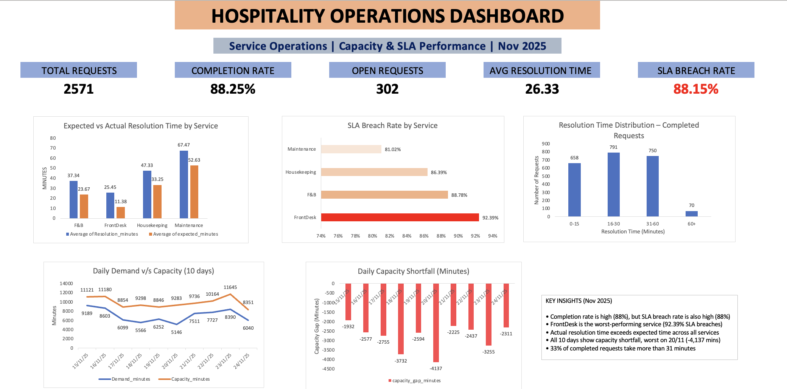

# Hospitality Operations Dashboard (Excel + SQL)

## Overview
End-to-end operational analytics project built to simulate **MI reporting** in hospitality operations.
SQL was used to prepare and validate data and Excel was used to create KPI logic and the final dashboard.

**Why This Dashboard Matters**

This dashboard is designed to replicate real-world operational MI reporting used by hospitality operations teams to monitor service performance, staffing pressure, and SLA compliance.

In high-volume service environments, operational risk rarely comes from a single failure. Instead, it accumulates through rising demand, delayed resolutions, growing backlogs, and repeated SLA breaches. This dashboard brings these signals together by combining:

- Service request volumes and completion rates
- Open backlog and unresolved demand
- Actual vs expected resolution times
- SLA breach patterns by service type
- Demand vs capacity gaps over time

By visualising these metrics in one view, the dashboard enables operations teams to identify pressure points early, rather than reacting after service levels have already deteriorated.

The insights produced support day-to-day operational decision-making, including:

- identifying underperforming services,
- prioritising backlog reduction,
- validating whether capacity is structurally insufficient,
- informing staffing and shift planning decisions,
- tracking the operational impact of process changes over time.

 Overall, this project reflects how data is used in operations, MI, and service performance teams,not just for reporting, but as a decision-support tool for service optimisation and continuous improvement.

Built to simulate operational MI reporting used in hospitality and other large-scale service environments.
 
## Dashboard Preview

## Data Used
- service_requests.csv (SLA and service type performance)
- service_assignments.csv (completion + resolution time efficiency)
- staff_shifts.csv (capacity inputs)
- quality_checks.csv (data quality tracking)
- demand_capacity_daily.csv (MI demand vs capacity)

## Workflow
1. Load and validate data in SQL (MySQL)
2. Create views for analysis-ready fields (resolution_minutes, SLA flag)
3. Export CSV → import into Excel via Power Query
4. Create helper columns and pivots
5. Build KPI summary and dashboard charts

## Key KPIs
- Total Requests
- Completion Rate
- Open Requests
- Avg Resolution Time
- SLA Breach Rate
- Capacity Shortfall (daily + overall)

Detailed KPI construction, pivot tables, and summary logic can be found in the dashboard screenshots and Excel logic documentation.

**KPI Summary and Pivot Table Screenshots:** [`/dashboard_screenshots`](dashboard_screenshots/)

## Key Insights
- Completion rate is high (88%), but SLA breach rate is equally high (88%), indicating that requests are being closed but often too late.
- FrontDesk is the worst-performing service, with the highest SLA breach rate (92.39%), pointing to a service-level bottleneck.
- Actual resolution times exceed expected benchmarks across all services, suggesting SLA targets may be unrealistic.
- Capacity shortfall is observed on all 10 days, confirming a structural resourcing issue rather than a one-off demand spike.
- Approximately one-third of completed requests take more than 31 minutes, contributing significantly to SLA failures.

**For detailed analysis and recommendations, see** [`insights/key_insights.md`](insights/key_insights.md).

## Future Analysis & Enhancements

This dashboard represents a point-in-time operational snapshot. Several extensions could further enhance its value for ongoing MI reporting:

- **Multi-period trend analysis:** Extend the dashboard to cover multiple weeks or months to identify seasonal patterns and sustained performance shifts.
- **Service-level drilldowns:** Introduce deeper analysis by priority level, request type, or shift to better isolate root causes of SLA breaches.
- **Staff utilisation analysis:** Combine request resolution data with staff shift information to assess utilisation, idle time, and workload balance.
- **Predictive capacity planning:** Use historical demand patterns to forecast future capacity requirements and proactively prevent shortfalls.
- **Automation & refresh:** Migrate the model to Power BI or scheduled Excel refreshes to support recurring operational reporting.
- **Data quality monitoring:** Add explicit KPIs to track missing timestamps, late updates, and data completeness over time.

These enhancements would support a transition from descriptive reporting toward **predictive and proactive operations management**.

## Skills Demonstrated
- Operational KPI design
- SLA & backlog analysis
- Capacity planning
- SQL data preparation
- Excel pivot modeling
- Executive-style insight writing
  
## Documentation
- Helper columns: [`excel_logic/helper_columns.md`](excel_logic/helper_columns.md).
- KPI definitions: [`excel_logic/kpi_definitions.md`](excel_logic/kpi_definitions.md).
- SQL scripts: [`/sql`](/sql).

## Notes
Due to local Excel licensing restrictions, the workbook could not be exported.  
This repository provides:
- raw datasets (CSV)
- dashboard screenshots
- full logic documentation (SQL + Excel)

